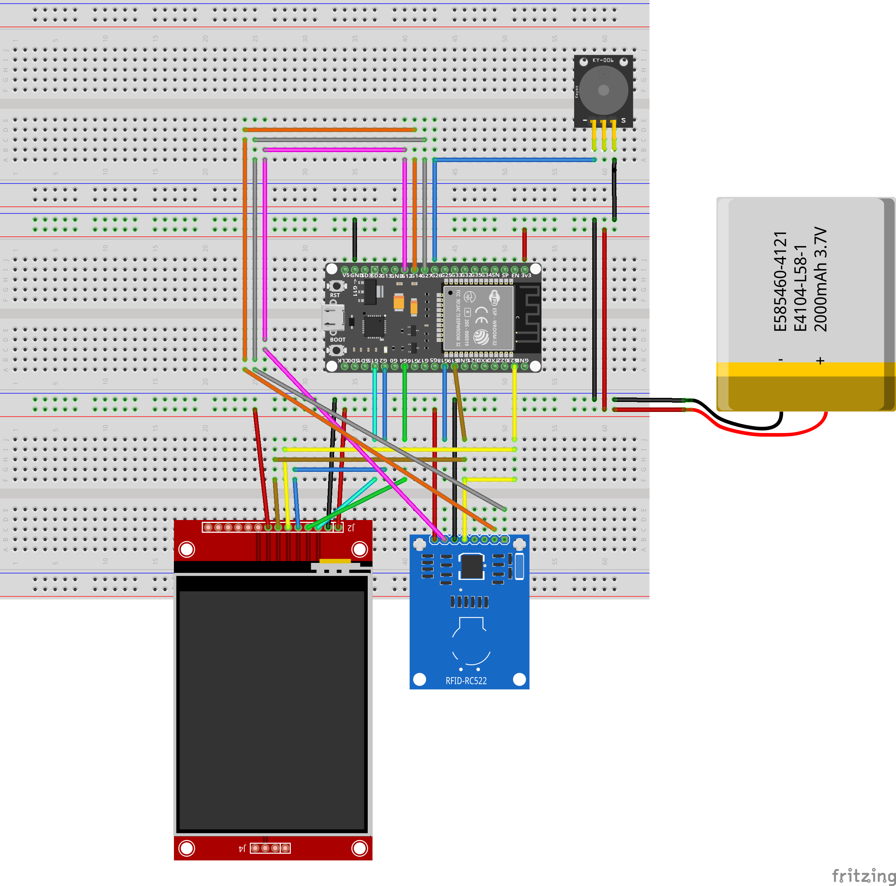

# TPE

Cette section traite est composée de deux sous sections, abordant la partie matérille du terminal de paiement dans la première, puis la partie logiciel de celui-ci dans la seconde.

## HARDWARE

### Composants utilisés

Voici la liste des composants utilisé dans la réalisation du TPE.

> - [esp32](https://www.espressif.com/en/products/socs/esp32), module de programmation qui intègre directement le Wifi et Bluetooth Low Energy (BLE).
> - [Écran](https://fr.aliexpress.com/item/1005001999296476.html?spm=a2g0o.productlist.0.0.6a9580d2zZOAoY&algo_pvid=4948553b-13dc-44af-ba77-a004d1cad1a7&algo_exp_id=4948553b-13dc-44af-ba77-a004d1cad1a7-0&pdp_ext_f=%7B%22sku_id%22%3A%2212000018365356571%22%7D&pdp_npi=2%40dis%21EUR%219.53%218.58%21%21%21%21%21%402100bddd16705076985542768ebb9d%2112000018365356571%21sea&curPageLogUid=HsVstVVf9EIC): module d'affichage LCD série SPI HD 3.5 pouces, 480x320 TFT.
> - [RFID](https://www.amazon.fr/AZDelivery-lecteur-Arduino-Raspberry-d%C3%A9marrage/dp/B074S8MRQ7/ref=sr_1_1_sspa?keywords=Arduino+Rfid&qid=1670507863&sr=8-1-spons&sp_csd=d2lkZ2V0TmFtZT1zcF9hdGY&psc=1&smid=A1X7QLRQH87QA3): module de communication RFID, pour effectuer un paiment sans contact.
> - [Buzzer](https://www.amazon.fr/AZDelivery-KY-006-dalarme-Arduino-compris/dp/B089QHLRSG/ref=sr_1_1_sspa?__mk_fr_FR=%C3%85M%C3%85%C5%BD%C3%95%C3%91&crid=4U33JS1R58CS&keywords=Arduino+buzzer&qid=1670508056&sprefix=arduino+buzzer%2Caps%2C111&sr=8-1-spons&sp_csd=d2lkZ2V0TmFtZT1zcF9hdGY&psc=1&smid=A1X7QLRQH87QA3): permet d’émettre un son lorsque les données en RFID on été lues avec succès.

### Coque 3D

La coque du terminal a été créée à l'aide d'une imprimante3D et de plastique dit PLA, pour cela la coque a été modélisée sur le logiciel [Tinkercad](https://www.tinkercad.com/), puis le fichier 3D a été slicé a l'aide de [Simplify3D](https://www.simplify3d.com/) afin de créer un `.gcode` format utilise par l imprimante.

### Montage

Voici un svg du schéma de montage du TPE réalisé a l'aide de [Fritzing](https://fritzing.org/)

---

## LOGICIEL

### Technologies utilisées

Le Projet a été codé avec le Framework Arduino. Nous avons aussi utilisé, [PlatformIo](https://platformio.org/) avec lequel nous avons généré le projet, installé les dépendances et téléchargé le programme sur le TPE.

### Dépendances

> - [TFT_eSPI](https://github.com/Bodmer/TFT_eSPI?utm_source=platformio&utm_medium=piohome): Librairie utilisée pour l'affichage sur l’écran TFT.
> - [MFRC522-spi-i2c-uart-async](https://github.com/makerspaceleiden/rfid?utm_source=platformio&utm_medium=piohome): Librairie utilisée pour le module RFID.

### Norme du projet

Afin de contribuer au développement du TPE, et dans le but de standardiser le code, d’éviter des changements inutiles et de maintenir la qualité du code, l'équipe se base sur les normes utilisées pour les projets C/C++.

### Déploiement

Nous utilisons Git et travaillons sur des branches qui sont ensuite ré-évaluées par des pairs afin d'intégrer le travail dans la branche principale.

Le déploiement se fait par la suite grâce à platformIO, qui permet de compiler le projet, puis le téléverser sur le TPE via câble USB.

### Contribution

L’équipe Pizzi utilise la gestion de configuration Git afin de garder une trace de chaque version de l’application et du travail de chacun.
